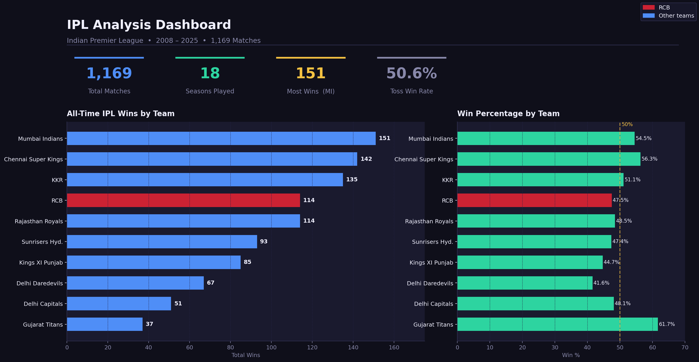
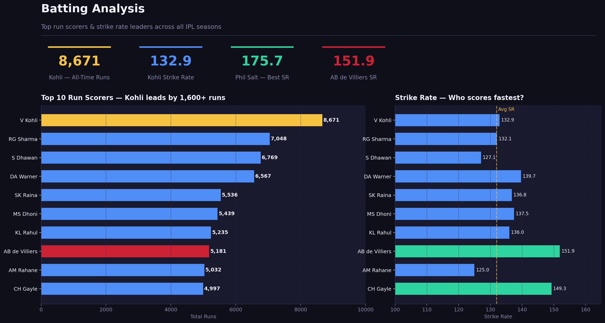
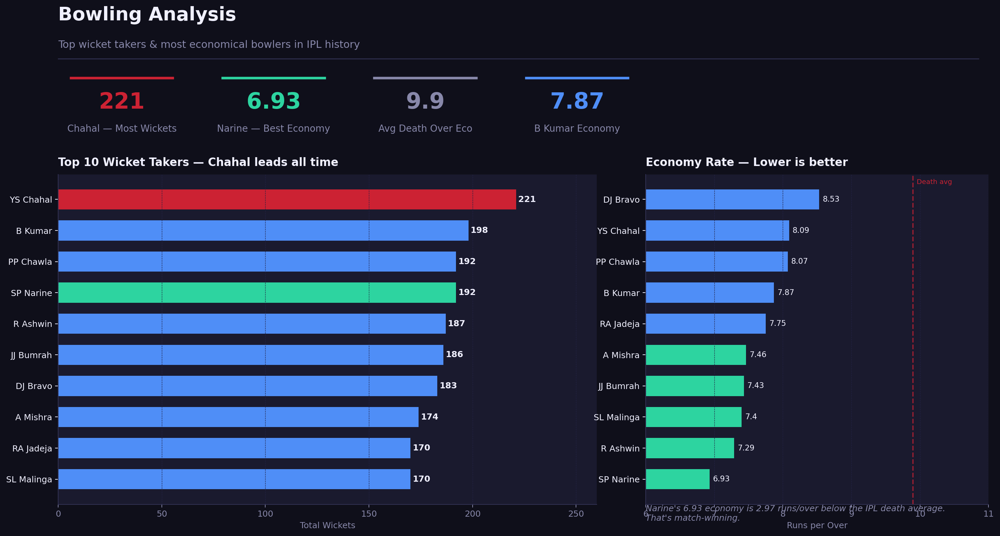
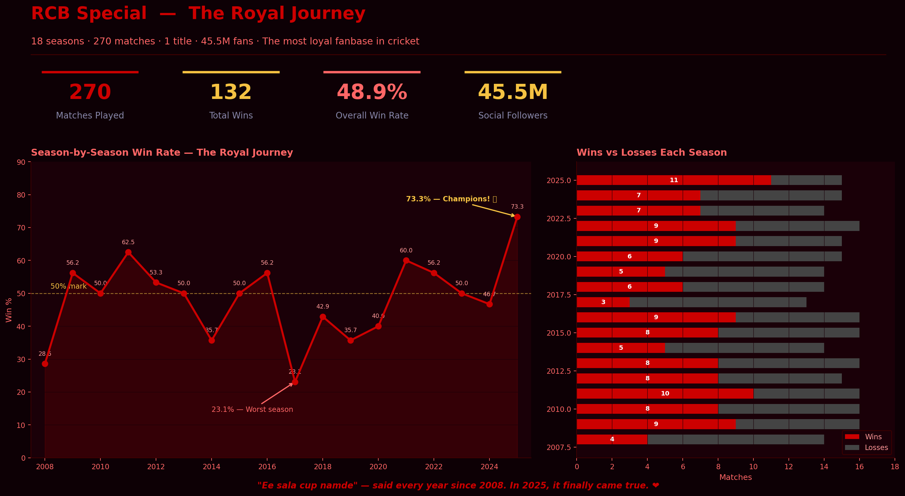

# 🏏 IPL Data Analysis — 2008 to 2025

A complete data analysis of **18 IPL seasons**, **1,169 matches**, and **278,000+ ball-by-ball deliveries** — built with Python, pandas, and Power BI.

---

## Dashboard Preview

| Overview | Batting |
|----------|---------|
|  |  |

| Bowling | RCB Special ❤️ |
|---------|----------------|
|  |  |

---

## What This Project Covers

| # | Analysis | Key Finding |
|---|----------|-------------|
| 1 | Toss Impact | Toss winners win only **50.6%** — barely better than a coin flip |
| 2 | Team Success | Mumbai Indians lead all time with **151 wins** |
| 3 | Death Over Bowling | Narine's economy of **6.93** is 2.97 runs below the IPL average |
| 4 | Top Batters | Kohli leads with **8,671 runs** — 1,600+ ahead of 2nd place |
| 5 | Strike Rate Leaders | Phil Salt leads at **175.7** — 44 runs per 100 balls above average |
| 6 | Season Dominance | Team fortunes shift dramatically — no single team dominates every era |
| 7 | Venue Analysis | Sawai Mansingh (Jaipur) is the most chase-friendly venue at **67.9%** |
| 8 | RCB Journey | 18 seasons, 1 title, **45.5M followers** — the most loyal fanbase in cricket |
| 9 | RCB vs Big 3 | In 2025, RCB's **11 wins** beat MI, CSK and KKR in the same season |
| 10 | Fan Loyalty Index | RCB leads all IPL teams in social following — built before winning the title |

---

## Tools Used

| Tool | Purpose |
|------|---------|
| Python (pandas) | Data cleaning and analysis |
| matplotlib / seaborn | Static chart generation |
| SQL | Data querying and aggregation |
| Power BI | Interactive dashboard |
| Jupyter Notebook | Analysis environment |

---

## Files in This Repository

```
├── IPL_Analysis.ipynb        ← Main analysis notebook (10 analyses)
├── ipl_analysis_starter.py   ← Starter code for the 5 core analyses
├── ipl_rcb_fans_extra.py     ← RCB fan loyalty analysis code
├── export_for_powerbi.py     ← Exports clean CSVs for Power BI
├── IPL_Beautiful.pbix        ← Power BI dashboard file
├── page1_overview.png        ← Dashboard screenshot — Overview
├── page2_batting.png         ← Dashboard screenshot — Batting
├── page3_bowling.png         ← Dashboard screenshot — Bowling
├── page4_rcb.png             ← Dashboard screenshot — RCB Special
└── README.md                 ← This file
```

---

## How to Run

**1. Clone the repo**
```bash
git clone https://github.com/YOUR_USERNAME/ipl-data-analysis
cd ipl-data-analysis
```

**2. Install dependencies**
```bash
pip install pandas matplotlib seaborn jupyter
```

**3. Download the dataset**
- Download `IPL.csv` from [Kaggle IPL Dataset](https://www.kaggle.com/datasets)
- Place it in the same folder as the notebook

**4. Run the notebook**
```bash
jupyter notebook IPL_Analysis.ipynb
```

**5. Open the dashboard**
- Open `IPL_Beautiful.pbix` in Power BI Desktop (free download from microsoft.com)

---

## Key Insights

### Does the toss matter?
Not really. Toss winners win just **50.6%** of matches. However, teams that chose to **field first** after winning the toss had a **53.4% win rate** vs 45.2% for batting first — showing modern T20 strategy strongly favours chasing.

### Who is the greatest IPL batter?
By volume — **Virat Kohli** with 8,671 runs. But by explosiveness — **AB de Villiers** with a 151.9 strike rate among the top 10 scorers. The data shows these are two completely different skills.

### The RCB story
RCB played **270 matches** with a 48.9% win rate — never winning a title for 17 years. Yet they lead all IPL teams with **45.5M social media followers**. Their 2025 championship run with a **73.3% win rate** was their best season ever. That fanbase waited 17 years. That is loyalty.

---

## About This Project

This project was built as part of my data analyst portfolio while preparing for international job applications. It covers the full analyst workflow: raw data → cleaning → analysis → visualisation → storytelling.

**Connect with me on LinkedIn:** [Your LinkedIn URL]

---

*"Ee sala cup namde" — said every year since 2008. In 2025, it finally came true. ❤️*
